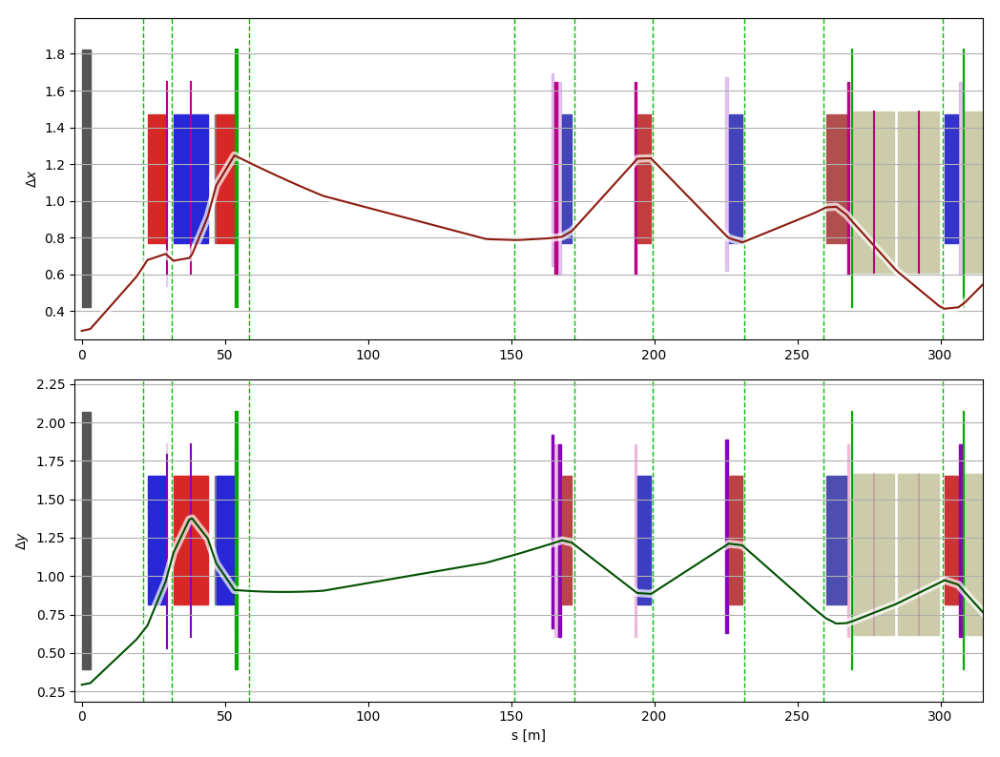

Welcome to madgui's documentation!
==================================

madgui_ is a Qt5 graphical user interface (GUI) written in Python, designed and developed to extend the interactivity, usability and utility of the MAD-X_ project. Given a certain input file for MAD-X_, madgui_ is capable of showing the simulated lattice in an interactive way. Up until now it offers a very comfortable graphical representation of relevant quantities (e.g. beam envelope, alpha and beta optical functions, emittance, etc.), which aid to the control of the optimal parameters for the studied machine or lattice.

.. _madgui: https://github.com/hibtc/madgui
.. _MAD-X: http://cern.ch/mad

The following is an example, which can be found on the MAD-X-examples_ repository under the Touschek-directory_, where the Touschek lifetimes and scattering rates are computed for LHC at injection. The beam envelope [mm] is shown for the first 300 m of the lattice.

.. _MAD-X-examples: https://github.com/MethodicalAcceleratorDesign/madx-examples
.. _Touschek-directory: https://github.com/MethodicalAcceleratorDesign/madx-examples/tree/master/touschek

Contents
========

.. toctree::
   :maxdepth: 2

   installation
   getting-started
   devguide/index
   api/madgui
   proxysettings

Links
=====

- `Source code`_
- `Issue tracker`_
- `Latest release`_
- `MAD-X source`_

.. _Source code: https://github.com/hibtc/madgui
.. _Issue tracker: https://github.com/hibtc/madgui/issues
.. _Latest release: https://pypi.org/project/madgui
.. _MAD-X source: https://github.com/MethodicalAcceleratorDesign/MAD-X

Indices and tables
==================

* :ref:`genindex`
* :ref:`modindex`
* :ref:`search`
